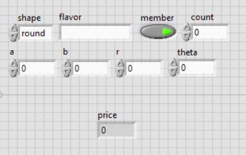

# LV101-assignment-1
In this assignment, you will write a LabVIEW program to calculate the price for a cake shop. You need to use your knowledge in variables, operators, case structure, and cluster to complish the assignment.
The files you need to modify are <code>cake_size.vi</code>, <code>discount.vi</code>, <code>total.vi</code>, and <code>main.vi</code>.   After finishing these VIs, you can run the `main.vi` to testify your work. 

## <code>cake_size.vi</code>
This VI has five input variables: shape, r, a, b, and theta. Note taht shape is an enum and others are floats. The VI should calculate and output the size of the cake as a float. 
- If the shape is "rectangle", the size would be $`a \times b`$.
- If the shape is "round", the size would be $`\pi r^{2}`$.
- If the shape is "triangle", calculates the size by the law of sines: $`\frac{1}{2} ab \sin{\theta}`$.
- If none of the cases above, outputs 0.

## <code>discount.vi</code></h3>
This VI has a input cluster which contains three values: size(float), flavor(string), and member(boolean). There are two kinds of discounts:
- The buyer is a member(member variable is true) and the cake is chocolate taste.
- The size is larger than 100 and the cake is not chocolate taste.
If either of the above cases is met, the VI should output 0.8 meaning a 20% discount. Otherwise, outputs 1 meaning the original price. The output should be a float.

## <code>total.vi</code>
This VI has three input variables: size(float), discount(float), and count(integer). The CI should output the total price which is the multiply of size, discount, and item count. However, the cake shop has a special "buy two get one free" discount. Thus, for every three cakes, the third cake would be free. So three cakes only charge the price of two, four cakes charge three, five cakes charge four, six cakes charge four, and so on. Round the price to nearest integer.

## <code>main.vi</code>
This VI uses cake_size.vi, discount.vi, and total.vi to calculate the total price of cakes. You should create appropriate controls and indicators yourself and arrange like this:

